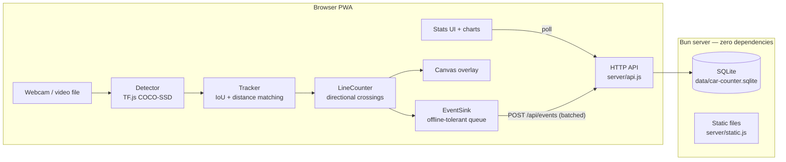

# Architecture

## Overview

Car Counter is deliberately split so that the **heavy, privacy-sensitive work
(video + ML) stays in the browser** and the server only ever sees tiny,
anonymous crossing events:



One crossing event is ~100 bytes of JSON: timestamp, direction (`fwd`/`rev`),
vehicle class, confidence, track id. No frames, no images, no identifiers.

## Components

### Server (`server/`)

Built exclusively on [Bun](https://bun.sh) built-ins (`Bun.serve`,
`bun:sqlite`) around web-standard `Request`/`Response` — there is no
`node_modules`. Three modules:

- **`index.js`** — `Bun.serve` fetch handler, request routing, JSON body
  handling (512 KB limit via `maxRequestBodySize` + an explicit check),
  security headers, graceful shutdown. Exports `createApp()` /
  `startServer()` so tests run the whole server on an ephemeral port with an
  in-memory database.
- **`api.js`** — route table and input validation (`ApiError` carries the HTTP
  status); pure functions of `(store, {query, body})`, runtime-agnostic. See
  [api.md](api.md).
- **`db.js`** — `Store` class wrapping `bun:sqlite` with WAL mode, prepared
  statements, transactional batch inserts, and time-bucketed aggregation
  (minute/hour/day in **server-local time**, zero-filled). SQL pre-aggregates
  into UTC minute buckets only; all calendar math (hours, DST-safe days,
  bucket keys) happens in JS so there is a single source of local time —
  SQLite's own `localtime` modifier uses libc and can disagree with the JS
  engine's timezone. The schema:

```sql
events(id, ts, direction CHECK IN ('fwd','rev'), class, confidence,
       track_id, source, received_at)   -- + index on ts
config(key PRIMARY KEY, value JSON, updated_at)
```

### Frontend (`public/`)

ES modules, no framework, no build step. The pure-logic modules
(`geometry.js`, `tracker.js`, `counter.js`) have no DOM dependencies and are
unit-tested in Node directly.

| Module | Responsibility |
|---|---|
| `main.js` | Orchestration: wiring, config persistence, zoom view, the rAF loop |
| `camera.js` | getUserMedia / video-file sources |
| `detector.js` | Backend-pluggable detection: YOLOX via ONNX Runtime Web (WebGPU/WASM) or TF.js COCO-SSD |
| `yolox.js` | YOLOX pre/post-processing: letterbox, grid decode, NMS (pure, tested) |
| `tracker.js` | ByteTrack-style tracking with motion prediction (see [detection-and-tracking.md](detection-and-tracking.md)) |
| `counter.js` | Directional line-crossing detection (one instance per line) |
| `geometry.js` | Shared 2D math (side-of-line, segment intersection, IoU, …) |
| `overlay.js` | Crisp canvas rendering through the zoom transform: boxes, trails, lines + arrows, zones, handles, pulses |
| `zones.js` | `ShapeEditor` — draw/select/move/reshape/delete lines & zones, lane splitting, pan while zoomed |
| `speed.js` | `SpeedMatcher` — per-vehicle speed from timed gate-pair crossings |
| `api.js` | Server client, presets, offline event queue (localStorage) |
| `stats-ui.js` | Live tiles, polling, history controls |
| `charts.js` | Dependency-free SVG charts (stacked bars, sparkline, table) |

Shapes (any number of counting lines and zones) are stored **normalized
(0..1)** relative to the video frame, so they survive resolution changes; all
pipeline math runs in full-frame video pixel space. The digital zoom is a CSS
transform on the video plus a matching canvas transform on the overlay —
and the detector receives the **visible crop only**, so zooming raises the
effective resolution the model sees. Each line owns a `LineCounter`; events
carry the line's id.

### Configuration flow

Settings (line, zone, confidence threshold, class filter, count mode) are
persisted server-side via `PUT /api/config` (debounced) and mirrored to
localStorage as an offline fallback — so a kiosk device reboots into a fully
configured state.

### PWA (`sw.js`, `manifest.webmanifest`)

Caching strategy, chosen after getting burned by stale-shell bugs during
development:

- **App shell + `/api` reads: network-first** with cache fallback — updates
  apply immediately when online; the dashboard still renders (last-known
  data) offline.
- **`/vendor/` (ML runtime + model, ~16 MB): cache-first** — downloaded once,
  then served locally forever.

The event queue lives in the page (localStorage), not the service worker, so
crossings recorded offline upload when connectivity returns.

## Security

- **CSP** locks the app to its own origin plus the two ML fallback hosts
  (jsDelivr, storage.googleapis.com). `'unsafe-eval'` is required because
  TensorFlow.js generates kernel code with `new Function` — this is a known
  TF.js constraint, accepted here because the app is designed for
  localhost/LAN use.
- **COOP/COEP** (cross-origin isolation) is enabled so the ONNX runtime's
  WASM fallback can use threads; CDN-fallback scripts load with
  `crossorigin="anonymous"` to satisfy it.
- Static serving resolves paths against the public root and rejects
  traversal; API inputs are validated field-by-field (timestamp windows,
  direction whitelist, size caps); destructive deletion requires
  `?confirm=yes`.
- The server binds to `0.0.0.0` for LAN use but has no authentication — do
  not expose it to the public internet as-is. Put it behind a reverse proxy
  with auth/TLS if you need remote access.

## Privacy

Video frames never leave the browser. The server stores only numeric crossing
events. There is no tracking, no third-party requests after `bun run setup`
(with vendored model), and the whole system runs air-gapped.

## The counting engine (`worker/engine.js`)

The server **hosts the counting pipeline itself** — in a dedicated worker
thread, so per-frame work (pixel conversion, tensor marshaling) can never
add latency to HTTP handling (measured: <1 ms API latency at p95 under full
1080p load). `CountingEngine` captures
frames with ffmpeg (webcam or a video file), runs YOLOX on
`onnxruntime-node` (CoreML on Apple silicon → CPU fallback), and counts with
the **same pure modules the browser uses** — `tracker.js`, `counter.js`,
`speed.js`, `yolox.js` decode. Events go straight into the Store; ffmpeg
additionally emits a rate-limited, atomically-updated JPEG that the server
exposes as `GET /api/preview` (snapshot) and `GET /api/preview.mjpeg`
(low-latency push stream), so the web UI can display the road, draw
shapes and show live tracks **without ever touching the camera** — the page
is a pure window onto the server.

**Camera capture — the native helper.** ffmpeg's `avfoundation` input can
only select a camera's *uncompressed* pixel formats, and USB-2 UVC webcams
cap uncompressed transfer hard: a C922 delivers **5 fps at 1080p** (10 fps
at 720p) that way, silently, even when 30 fps is requested. The cameras'
30 fps modes are MJPEG-only — which is what browsers negotiate via
getUserMedia, and why the same camera "worked at 30" in the browser.
`worker/capture.swift` (compiled to `worker/.bin/cc-capture` by `bun i`;
~100 lines) opens the camera through AVCaptureSession, which picks those
MJPEG modes, and streams decoded NV12 frames into ffmpeg's stdin — same
filter chain from there on. Measured: 5.5 fps → **24-30 fps** at 1080p and
**59 fps** at 720p. Without swiftc the engine falls back to the plain
ffmpeg path.

Two macOS traps live in that helper, both learned the hard way: session
presets silently override `activeFormat` unless the format is set *after*
`startRunning()` (at 1080p the default preset coincidentally matched; at
720p60 the camera kept sending 1080p and every downstream frame parsed as
striped garbage), and the delivered-buffer dimensions are therefore
verified per frame — a mismatch aborts loudly instead of garbling.

**Resolution vs frame rate:** 60 fps requires 720p on the C922, which
halves the pixels on the road band. On a distant, zoomed view that
collapses detection recall (tested live: five visible cars, zero
detections) — capture quality was fine, the cars were simply too small.
Prefer 1080p30 for far side-views; 720p60 suits closer, wider scenes.
Both are two clicks in Settings → engine capture/fps.

**Realtime channel.** `GET /api/ws` upgrades to a WebSocket on which the
server pushes a track snapshot **per processed frame** (~24-30/s) plus
status every 250 ms — and the preview frames themselves as binary
`[float64 server-ts][jpeg]` messages. Because the displayed frame's
timestamp and `tracksTs` share the server clock, the overlay dead-reckons
every track to the exact moment of the image on screen: boxes neither
trail nor lead the cars, with no guessed latency constants and no
dependence on the client's clock (remote browsers stay correct). HTTP
polling and the MJPEG stream remain as fallbacks when the socket is down
(it reconnects itself).

Caveat learned the hard way: under `bun --hot`, publishers and websocket
handlers from *before* a reload can keep serving while new module code
never runs (the process can even wedge mid-reload). Symptoms look like
"my change does nothing" while the server responds normally — verify with
an observable marker and restart `bun dev` when in doubt.

- `GET /api/engine` — status: running, model, execution provider, det/s,
  latency, counted, live track snapshot for the overlay.
- `PUT /api/engine {running, device?, size?, fps?, input?}` — start/stop;
  enablement persists in the config, so the engine auto-starts with the
  server.
- `PUT /api/config` nudges the running engine: thresholds/lines/zones apply
  live; a view (zoom) or model change restarts the capture with the new
  crop.

The engine is optional: without ffmpeg or the worker deps
(`bun install --cwd worker`) the server runs as before and the **browser
pipeline does the counting** (fallback mode). Both must not count the same
camera at once — the UI hides its camera controls while the engine runs.
`worker/index.js` remains a thin CLI around the same engine class for
running capture on a different machine than the server, posting over HTTP.
